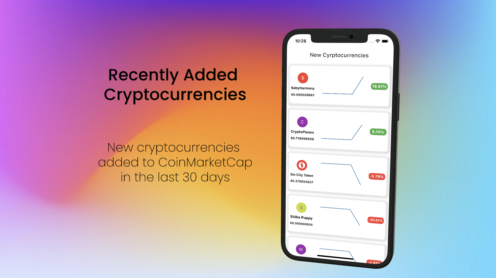

# Q Crypto

Sample Flutter cryptocurrency project that aim to how to combine and integrate  BLoC, Networking (currencies api call), Refresh Indicator and Drawing Charts.

## All in one
    - Project Setup
    - REST API
    - Data Provider
    - Repository
    - Business Logic (BLoC)
    - Reflesh Indicator
    - Syncfusion Flutter Charts

## Getting Started
- For the get currencies info you should have currencies API, so this project was used coinmarketcap API .
  - create .env file and add YOUR_API_KEY

